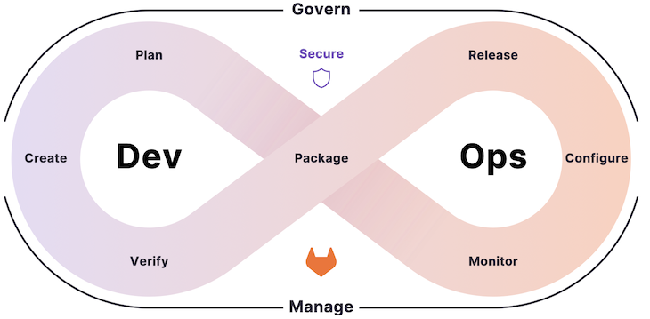
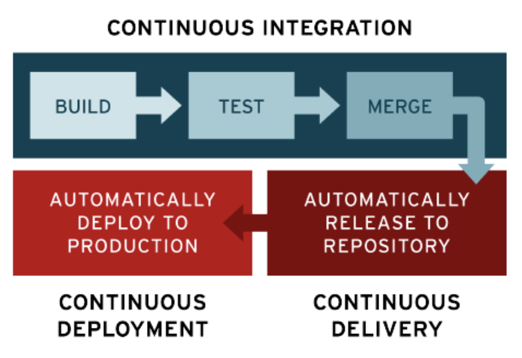
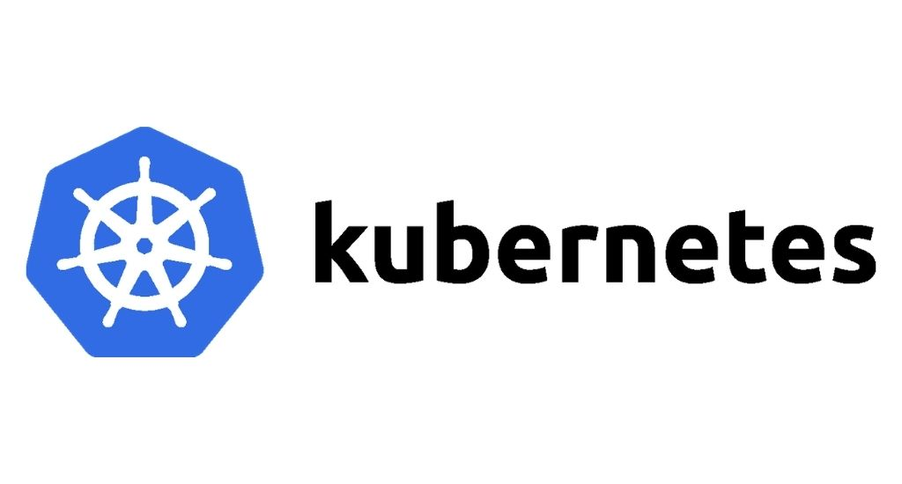

---
hide:
  - navigation
  - toc
---
# Devops expliqué

> **DevOps et les pratiques techniques, architecturales et culturelles** qui en résultent représentent une convergence de nombreux mouvements philosophiques et managériaux.  
...  
Il y a des décennies de leçons tirées de la fabrication, des organisations à haute fiabilité, des modèles de gestion à haute confiance et d'autres qui nous ont amenés aux pratiques DevOps que nous connaissons aujourd'hui.  
DevOps est le résultat de l'application des principes les plus fiables du domaine de la fabrication physique et du leadership au flux de valeur informatique.  
DevOps s'appuie sur des corpus de connaissances issus du Lean, de la théorie des contraintes, du système de production Toyota, de l'ingénierie, de la résilience, des organisations apprenantes, de la culture, de la sécurité, des facteurs humains et bien d'autres.  
DevOps s'appuie également sur d'autres contextes précieux, notamment les cultures de gestion à haut niveau de confiance, le leadership des serviteurs et la gestion du changement organisationnel.  
**Le résultat est une qualité, une fiabilité, une stabilité et une sécurité de classe mondiale à un coût et des efforts toujours plus faibles, ainsi qu'un flux et une fiabilité accélérés tout au long du flux de valeur technologique, y compris la gestion des produits, le développement, l'assurance qualité, les opérations informatiques et la sécurité informatique.**  
Alors que la base de DevOps peut être considérée comme dérivée du [Lean](https://fr.wikipedia.org/wiki/Lean_(production)), de la théorie des contraintes et du mouvement Toyota Kata, beaucoup considèrent également DevOps comme **la suite logique du parcours logiciel Agile qui a commencé en 2001**.  
> *"Kim, Gene; Humble, Jez; Debois, Patrick; Willis, John; Forsgren, Nicole. The DevOps Handbook (pp. 57-58). IT Revolution Press. Édition du Kindle. "*

## Schéma heuristique

[Suivez ce lien](./resources/devops-mindnode.pdf) qui offre une vue "Mind map" de devops.

## Approche

L’approche DevOps propose **une vision plus efficace et intégrée de la culture informatique, l’automatisation et la conception** de plateformes, logiciels et applications.

Son but ? Augmenter la valeur ajoutée et améliorer la réactivité des entreprises grâce à une distribution plus efficace et rapide des produits logiciels tout en garantissant une satisfaction plus grande de leurs utilisateurs.

C’est rendu possible notamment à travers **une livraison itérative et accélérée** du produit logiciel via l’approche CI/CD, qui permet d'**accélérer la phase de développement, de livraison et de déploiement**.

**DevOps a convaincu et s’est déjà imposée dans les plus grandes entreprises comme Google, Microsoft ou Amazon.**

## DevOps concrètement, c’est quoi ?

### L’opposition Dev/Ops

Si votre organisation n’utilise pas DevOps, la création et la mise en place d’un logiciel ou d’une application informatique se font classiquement avec deux équipes aux objectifs très différents.

**Vos développeurs, ou Devs,** vont recueillir les exigences et construire le cahier des charges, développer un code qui va faire le logiciel, qu’ils vont ensuite tester et livrer. Toutes ces actions se déroulent dans un **environnement de développement**.

<figure markdown>
  { width="800" }
  <figcaption>Développeur</figcaption>
</figure>

À partir de là, vos **équipes opérationnelles, les Ops,** vont prendre la relève pour implémenter, faire tourner et maintenir le logiciel en marche dans un **environnement de production**.

Les objectifs des deux équipes sont plutôt antagonistes. Les Devs veulent livrer un produit le plus rapidement possible pour reculer le *time to market* ( = le moment où l’on peut lancer l’application).

Les nouvelles méthodes de gestion de projet ainsi que les technologies récentes permettent de réduire le temps de développement d’un logiciel ce qui permet d’être le premier à trouver une solution qui peut avoir l’exclusivité sur une innovation et bénéficier d’effets de “winner takes all”. La première entreprise à trouver une solution va prendre tout le marché sur le besoin précis auquel son innovation répond.

À l’opposé, les équipes opérationnelles (Ops) sont celles qui ont besoin de rendre opérationnel, faire marcher et maintenir le logiciel en marche. Le moindre bug dans un code livré trop rapidement peut leur coûter énormément de temps et donc coûter de l’argent.

Ainsi, quand **vos Devs recherchent plutôt la rapidité de livraison, vos Ops recherchent la stabilité du système**, et les deux peuvent s’opposer.

### Réunir Devs et Ops

L’approche DevOps vise à réaligner les objectifs des Devs et des Ops, et à les faire collaborer plus étroitement, d’où son nom : DevOps.

**DevOps est une culture qui prône la communication et la collaboration des Devs et des Ops, ainsi que le réalignement des objectifs des deux équipes vers un objectif plus large de maximisation de la valeur générée par le logiciel ou l’application informatique.**

L’objectif est de rassembler les deux pôles pour éviter toute dissonance et perte de temps. Dans la lignée de l’imposition des méthodes agiles, DevOps prône une démarche plus intégrée pour la conception et implémentation de logiciels et applications.

<figure markdown>
  [{ width="1024" }](https://about.gitlab.com/topics/devops/)  <figcaption>Cycle devops</figcaption>
</figure>

C’est notamment à travers une intégration et un développement plus en continu que vous pouvez faire collaborer vos Devs avec vos Ops.

### L’importance d’une implémentation et distribution itérative

Une implémentation et une distribution itératives, c’est-à-dire en plusieurs cycles successifs, permettent de garantir :

* D’une part que **le code sera accessible tout au long du processus de développement.**
* D’autre part que les développeurs ne s’opposent plus aux équipes opérationnelles puisque **le code est distribué et déployé au fur et à mesure de son écriture**, de sorte que **l’opérationnel puisse être supervisé également par les Devs.**

Implémenter progressivement les changements dans le code, et le garder actualisé et centralisé permet d’**avoir un code toujours à jour et testé à chaque ajout**, ce qui permet aux Devs de voir rapidement si leur code et leurs ajouts au code fonctionnent ou non en situation réelle.

Cette implémentation et cette distribution continue est formalisée dans **l’approche CI/CD**.

## La clef du succès de DevOps : L’approche CI/CD

DevOps prône une démarche plus intégrée entre Dev et Ops qui peut être plus facilement accessible avec une démarche CI/CD pour intégrer le travail des Devs directement et de manière itérative à l’opérationnel.

### CI / CD qu’est-ce que c’est ?

#### CI pour Continued Integration

**L’intégration en continu, ou CI, permet d’intégrer de manière automatique le code au fur et à mesure des modifications**, plutôt que de faire travailler les différents développeurs sur des parties distinctes du code pour tout fusionner à la fin.

Une intégration en continu permet de mettre à jour en permanence le code sur lequel tous **les développeurs peuvent alors travailler ensemble.**

À travers des tests eux aussi automatisés, les développeurs peuvent également voir si leur partie du code fonctionne avec les parties du code déjà existantes afin qu’ils puissent **résoudre les problèmes d’intégration au fur et à mesure du développement.**

Sans **CI accompagné de tests automatisés pour vérifier la bonne exécution du code au fil de l’intégration en continu**, tous ces problèmes de cohérence entre les différentes parties du code devraient être réglés au moment où les différents codes sont fusionnés, ce qui amène les développeurs à être face à une montagne de problèmes de cohérence qui créent des bugs. C’est ce qu’ils appellent “l’enfer de l’intégration”.

L’intégration continue vous permet de faire collaborer vos équipes opérationnelles et vos équipes de développeurs dans une seule et même équipe qui peut régler les problèmes d’intégration au fur et à mesure et travailler sur un code toujours actualisé, afin de **tendre vers un logiciel fini plus fonctionnel, produit plus rapidement et plus efficacement.**

<figure markdown>
  { width="800" }
  <figcaption>Intégration continue</figcaption>
</figure>
#### CD pour Continuous Delivery et Continued Deployment

CD est l’acronyme en anglais à la fois de **Déploiement Continu et de Delivery Continue.**

Les deux sens de CD désignent des concepts proches qui concernent l’automatisation du passage du code du logiciel, ou de l’application logicielle, **de l’environnement de développement vers l’environnement de production** (où le logiciel ou l’application est utilisé par le client).

Dans le cadre de la **livraison continue (delivery)**, les modifications et ajouts au code sont automatiquement testés puis le résultat est mis à disposition dans un référentiel de livrable tel que Artifactory, Nexus, Docker Hub, à partir duquel ils peuvent être ensuite déployés dans l’environnement de production.

Pour le **déploiement en continu,** les modifications au code sont directement déployées dans l’environnement de production une fois qu’elles ont passé les tests automatisés. Mais cette approche de déploiement continu peut effrayer certaines industries qui refusent d’automatiser la mise en production : la mise en place de mécanisme automatique de retour en arrière (rollback) est un moyen de rassurer sur ce point.

### Pourquoi adopter l’approche CI/CD ?

Combiner CI et CD vous permet d’**automatiser l’intégration du code, sa livraison ainsi que son déploiement** et donc de lier automatiquement et véritablement le développement du logiciel avec son déploiement. La réduction du “time to market” devient maintenant un objectif atteignable.

L’approche CI/CD permet également aux équipes de développement de gagner en efficacité et en temps de production pour **avancer le time to market du produit qu’ils développent, tout en réglant les problèmes d’opérabilité au fur et à mesure.**

Cette approche suppose que vos équipes mettent en place des tests automatisés à chaque étape de la CI comme des CD.

Ces tests permettent de vérifier à chaque “mise à jour” du code que les parties ajoutées ou modifiées fonctionnent et ne génèrent pas de régression.

Si les ajouts ne passent pas les tests, alors vos développeurs pourront rapidement les **ajuster**, de sorte que la mise en opération de leurs ajouts peut se faire relativement rapidement, ou en tous cas bien plus rapidement que s’ils ne voyaient les bugs qu’à la fin du processus de développement.

## L’automatisation des processus de CI/CD à travers des applications conteneurisées

**L’approche CI/CD suppose un assez grand degré d’automatisation** dans le flux d’intégration, de distribution et de déploiement du code, qui devient presque constant puisqu’à chaque fois qu’une ligne de code est écrite, elle est automatiquement testée et intégrée, puis automatiquement distribuée et déployée.

Pour automatiser ces processus, vous utiliserez des applications conteneurisées dont l’exécution des différents composants sera éventuellement orchestrée via [**Kubernetes**](https://kubernetes.io/fr/). À l'école d'informatique, les conteneurs docker sont actuellement exécutés sur le server gitlab même.

### Les applications conteneurisées

Les applications conteneurisées, ou conteneurs sont **des mini-ordinateurs qui embarquent une application ainsi que ses dépendances, et uniquement cette application un conteneur peut ensuite être exécuté sur un environnement compatible (généralement un ordinateur physique ou une VM dans le cloud).** C’est l’outil [Docker](https://www.docker.com/) qui est le plus couramment utilisé pour lancer des applications dans des conteneurs logiciels.

Ce sont des machines dont le système d’exploitation est **simplifié au maximum pour leur permettre de ne répondre qu’à une seule tâche ou un seul but.**

Réduites à l’essentiel, elles peuvent être bien plus **légères et rapides** qu’une machine plus complexe prévue pour effectuer des tâches plus diverses et/ou complexes.

Si un conteneur ne peut théoriquement pas réaliser à lui seul une tâche complexe, **l’intérêt de cette technologie est d’en construire plusieurs, mis en relation pour que chaque conteneur réalise sa tâche précise rapidement et qu’ensemble ils puissent effectuer des tâches complexes très rapidement**.

Les applications conteneurisées sont de plus en plus populaires, car elles sont simples à construire et rapides à démarrer.

Elles sont utilisées depuis plusieurs années par les géants du web. C’est notamment Google qui a créé une solution, aujourd’hui rendue disponible à tous, pour piloter sa flotte d’applications conteneurisées : Kubernetes.

### Kubernetes pour orchestrer ses conteneurs

Depuis 2014 Kubernetes est en open source et Google l’a cédé en 2015 à la CNCF (Cloud Native Computing Foundation).

Le système permet notamment de **regrouper plusieurs conteneurs en pods qui partageront alors une adresse IP, un système de fichier, et pourront collaborer dans l’exécution de leurs tâches.**

Regroupés et orchestrés avec le système Kubernetes, les différents composants qui composent une application (conteneurs, service, volumes, etc…) collaborent pour donner lieu à une application.

Source : [www.retengr.com](https://www.retengr.com/formations-devops/devops/) pour **former les différents acteurs de votre entreprise à la mettre en œuvre.**

